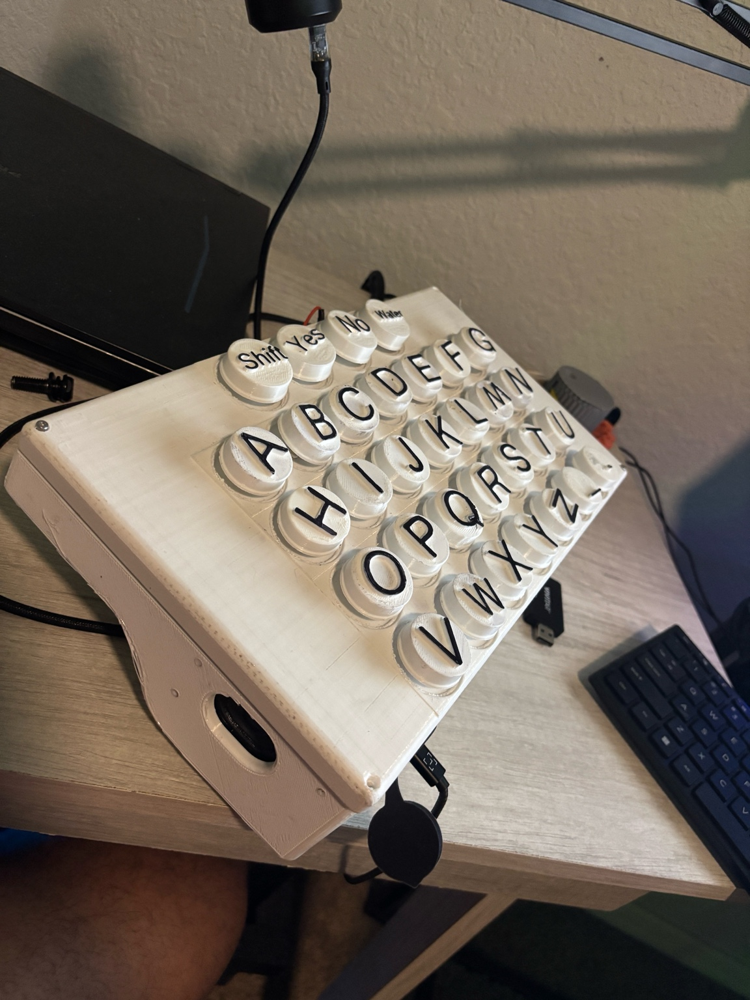

# Tactile Communication Device

A standalone letter-button communicator designed for individuals with Progressive Supranuclear Palsy (PSP) and low-vision users. This device provides tactile feedback and plays mapped MP3 phrases with multi-press cycling capabilities.

## 📸 Device Photos & Video


_The completed tactile communication device with large, accessible buttons_

🎥 **[Watch Device Demonstration on YouTube](https://www.youtube.com/watch?v=48gU_H7tQQE)**

_See the device in action - button presses, audio responses, and multi-press functionality_

## 🎯 Purpose

Built for my mother who has PSP and is nearly blind - she can feel and press tactile buttons but cannot use touchscreens or phones. This device enables communication through large, tactile letter-shaped buttons that play specific audio messages.

## ✨ Features

- **32+ Large Tactile Buttons**: Easy-to-feel letter buttons for accessibility
- **Multi-Press Support**: Press same button multiple times for different phrases (e.g., "T" → Thirsty, Tired, Toilet)
- **High-Quality Audio**: VS1053 codec for superior sound quality via built-in speaker
- **Fully Offline**: No internet required - all audio stored locally on SD card
- **USB-C Power**: Simple, reliable power connection
- **Custom Mapping**: Easy CSV-based button-to-phrase mapping system

## 🔧 Hardware Components

- **Arduino Uno R4 WiFi** - Main microcontroller
- **Adafruit VS1053 Music Maker Shield** - High-quality audio playback
- **2x PCF8575 I²C Port Expanders** - Support for 32+ buttons
- **Large Arcade/Tactile Buttons** - Accessible button interface
- **MicroSD Card (FAT32)** - Local audio storage
- **Speaker** - Clear audio output
- **USB-C Power Module** - Reliable power supply

## 📁 Repository Structure

<<<<<<< HEAD
```
tactile-comm-device/
├── firmware/               # Arduino firmware
│   └── tactile_comm_device_vs1053/
├── hardware/              # Wiring diagrams, BOM, enclosure files
│   ├── wiring-diagrams/
│   ├── bom/
│   └── enclosure/
├── audio/                 # Audio file organization and samples
├── docs/                  # Documentation and guides
├── media/                 # Photos and videos
=======
```text
tactile-comm-device/
├── firmware/               # Arduino firmware
│   └── tactile_comm_device_vs1053/
├── hardware/              # Wiring diagrams, documentation, enclosure files
│   ├── documentation/     # BOM and technical specs
│   ├── wiring-diagrams/
│   └── enclosure/
├── audio/                 # Audio file organization and samples
├── docs/                  # Setup and troubleshooting guides
├── media/                 # Device photos and demonstration videos
│   ├── photos/
│   └── videos/
>>>>>>> 785009de4c4dd3ab9dbcc13e88e5de660d3bb4b6
└── config/               # Sample configuration files
```

## 🚀 Quick Start

<<<<<<< HEAD
1. **Hardware Setup**: See `/hardware/wiring-diagrams/` for connections
=======
1. **Hardware Setup**: See **/hardware/documentation/bill-of-materials.csv** for complete parts list and **/hardware/wiring-diagrams** for connections.
>>>>>>> 785009de4c4dd3ab9dbcc13e88e5de660d3bb4b6
2. **Firmware**: Flash `/firmware/tactile_comm_device_vs1053/tactile_comm_device_vs1053.ino`
3. **Audio Setup**: Format SD card as FAT32, copy audio files to proper folders
4. **Configuration**: Add `config.csv` to SD card root (see `/config/sample_config.csv`)
5. **Power On**: Connect USB-C power, open Serial monitor @ 115200 baud

## 🎵 Audio Organization

Audio files are organized in numbered folders on the SD card:
- `/01/` - Special buttons (YES, NO, WATER, HELP)
- `/05/` - Letter A variations
- `/06/` - Letter B variations
- And so on...

Each folder contains numbered MP3 files (001.mp3, 002.mp3, etc.) that correspond to multiple presses of the same button.

## 🗺️ Button Mapping

The device supports both recorded human speech and generated TTS audio:
- **1st Press**: Clear TTS voice (consistent pronunciation)
- **2nd Press**: Personal recorded words (familiar voices)
- **3rd+ Press**: Additional variations

Example for button "A":
1. "Apple" (TTS)
2. "Amer" (recorded)
3. "Alari" (recorded)
4. "Arabic" (TTS)

## 🛠️ Configuration

Use Serial monitor commands:
- `C` - Enter calibration mode to assign button labels
- `P` - Print current button mappings
- `+/-` - Adjust volume
- `1-9` - Set specific volume levels
- `T` - Test all configured buttons
- `X` - Stop current audio playback

## 📖 Documentation

- **[Setup Guide](docs/setup-guide.md)** - Detailed hardware and software setup
- **[Mapping Guide](docs/mapping-guide.md)** - Button configuration and CSV format
- **[Troubleshooting](docs/troubleshooting.md)** - Common issues and solutions
- **[Maintenance](docs/maintenance.md)** - Care and updates

## 🤝 Contributing

This project is designed to help individuals with communication challenges. Contributions are welcome, especially:
- Additional language support
- Improved audio quality
- Enhanced button layouts
- Documentation improvements

See [CONTRIBUTING.md](CONTRIBUTING.md) for guidelines.

## 📄 License

MIT License - See [LICENSE](LICENSE) for details.

## 🙏 Acknowledgments

- Built with love for enhanced communication accessibility
- Thanks to the Adafruit community for excellent hardware and libraries
- Inspired by the need for inclusive assistive technology

---

**Note**: This is an open-source assistive technology project. Feel free to adapt and improve for similar use cases.
